# Bias-Variance-Tradeoff

 Calculation of the bias and variance after training two models.

 ## Getting Started

 Unzip the folder, run the scripts and view the saved tables and graphs for question 1 and 2 in the current directory.
```bash
$ unzip 33_assgn1.zip
$ cd 33_assgn1
$ python3 q1.py  # Graph and table will be displayed and saved in current directory
$ eog graph1.png
$ eog table1.png
$ python3 q2.py  #Graph will be displayed and saved in the current directory
$ eog graph2.png
$ eog table2.png

```
Alternately, 
```bash
$ unzip 33_assgn1.zip
$ cd 33_assgn1
$ make all
$ make seeOne  # Data visualization for question 1
$ make seeTwo  # Data visualization for question 2
$ make clean
```


 
 ## Libraries Used
 ```python
# For data handling  
import pickle 
import numpy as np
import pandas as pd 
# To generate training and testing data splits
from sklearn.model_selection import train_test_split
# For data visualization            
import matplotlib.pyplot as plot
# To generate polynomial data and train the models 
from sklearn.linear_model import LinearRegression
from sklearn.preprocessing import PolynomialFeatures
 ```

## Question 1

### Data Resampling 
- 5000 entries of the form ( x<sub>i</sub> , y<sub>i</sub> ) are present are loaded using the `pickle` library, in numpy format.
```python
file = open('Assignment/Q1_data/data.pkl', 'rb')
data =  pickle.load(file)
file.close()
```
- 90:10 split of data as training set and testing set is done once using the `train_test_split` from `sklearn`.
```python
X_train, X_test, Y_train, Y_test = train_test_split(X, Y, test_size = 0.1)
```
- The training data is then reshuffled using the `np.random.shuffle` function.
```python
training_data = np.column_stack((X_train, Y_train))
np.random.shuffle(training_data)
X_train = training_data[:, 0]
X_train = X_train[:, np.newaxis]
Y_train = training_data[:, 1]
```

- The training data is then split into 10 subsets using the `np.array_split` funtion. This is done because inorder to calculate the variance we need multiple realisations of the model. An easy way to achieve this is to randomly divide the training set (if feasible) into multiple subsets (here, `10`), so that we have `10` different realisations of model.
  
```python
X_train_split = np.array_split(X_train, 10)
Y_train_split = np.array_split(Y_train, 10)
```

- `PolynomialFeatures(i)` is used to raise `x` data points to powers from 0 to `i` to generate data for polynomials of degree `i`.


### Bias - Variance Tradeoff

> ***Variance*** is the variability of a model prediction for a given data point.

- We have repeated the entire model building process `10` times for each polynomial. The variance is how much the predictions for a given point vary between different realizations of the model.

This is calculated and averaged out for each polynomial as follows,
```python
    np.mean(np.var(poly_prediction, axis = 0))
```
- Here,  `poly_prediction` is a [10, 500] matrix containing the predicted outputs using the 10 models for each data point.

- `axis = 0` specificies that we traverse the matrix column-wise to obtain different model predictions for a single test data point.

>  ***Bias*** is the difference between the average prediction of our model and the correct value which we are trying to predict.

This is calculated and averaged out for each polynomial as follows,
```python
    (np.mean(poly_prediction, axis = 0) - Y_test)**2
```
- Here, `Y_test` represents the correct output value for the input data point.
  
### Listed are the plots for the models obtained using the `LinearRegression()` function using the first randomly generated test set for the respective polynomials.

### y = mx + c
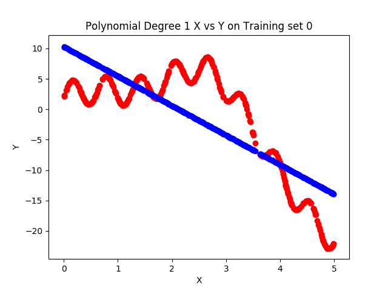
### y = ax<sup>2</sup> + bx + c
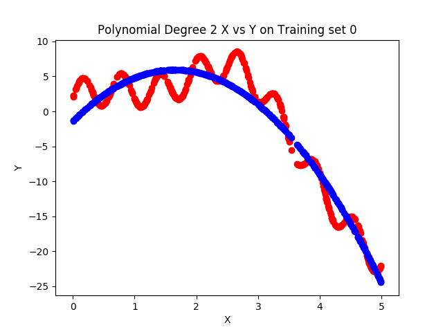

### y = ax<sup>3</sup>  + bx<sup>2</sup> + cx + d
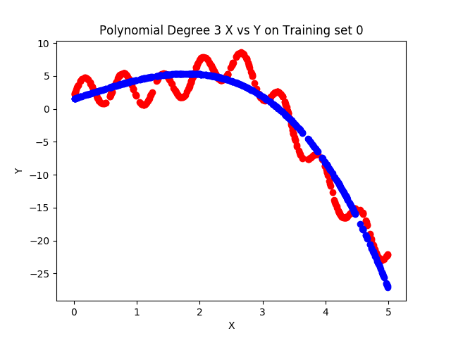

### y = ax<sup>4</sup>  + bx<sup>3</sup> + cx<sup>2</sup> + dx + e


### y = ax<sup>5</sup>  + bx<sup>4</sup> + cx<sup>3</sup> + dx<sup>2</sup> + ex + f
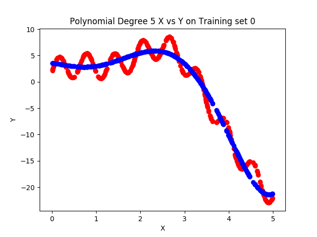

### y = ax<sup>6</sup>  + bx<sup>5</sup> + cx<sup>4</sup> + dx<sup>3</sup> + ex<sup>2</sup> + fx + g


### y = ax<sup>7</sup>  + bx<sup>6</sup> + cx<sup>5</sup> + dx<sup>4</sup> + ex<sup>3</sup> + fx<sup>2</sup> + gx + h
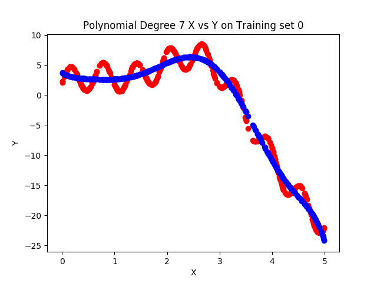

### y = ax<sup>8</sup>  + bx<sup>7</sup> + cx<sup>6</sup> + dx<sup>5</sup> + ex<sup>4</sup> + fx<sup>3</sup> + gx<sup>2</sup> + hx + i
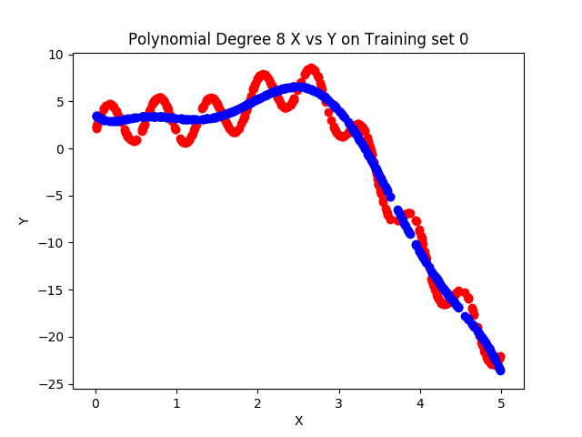

### y = ax<sup>9</sup>  + bx<sup>8</sup> + cx<sup>7</sup> + dx<sup>6</sup> + ex<sup>5</sup> + fx<sup>4</sup> + gx<sup>3</sup> + hx<sup>2</sup> + ix + j 
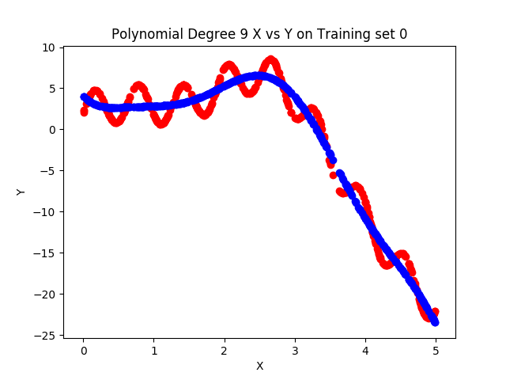


### Observervations

Here, it can be seen that the bias decreases as the complexity of the polynomial increases and the variance shows a slight increase as the degree of the polynomial increases.

This is in accordance with the Bias-Variance tradeoff where an optimum model is reached when total error is minimised.

When our polynomial is too simple and has very few parameters then a high
bias and low variance is observed. On the other hand, if our model has a large number of parameters then high variance and low bias is observed.

### Tabulated Values
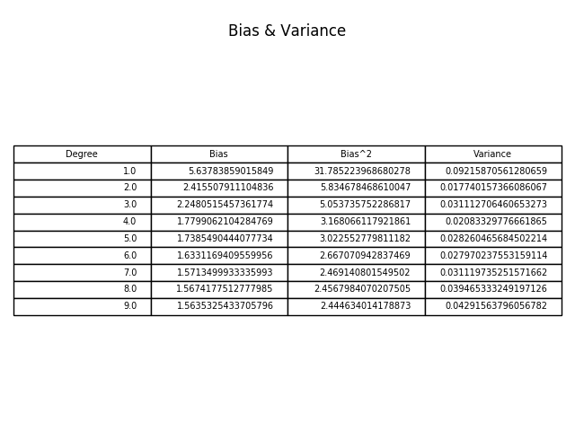
### Bias<sup>2</sup> Versus Variance Graph
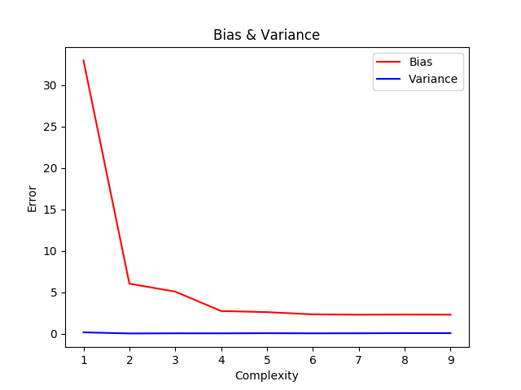

 ## Question 2

### Data Resampling 

- 20 subsets of 400 entries of X datapoints each are loaded as the training set and 1 set of 80 entries of X datapoints is loaded as the testing set using the `pickle` library, in numpy format. Corresponding Y sets are loaded as well.
  
- The training data has 20 subsets. This is now used to calculate the variance by generating multiple realisations of the model. 

- Now, the outer loop selects the degree of the polynomial and the inner loop chooses the training set and a model is generated using the 
  
### Bias - Variance Tradeoff

> ***Variance*** is the variability of a model prediction for a given data point.

- We have repeated the entire model building process `20` times for each polynomial. The variance is how much the predictions for a given point vary between different realizations of the model.

This is calculated and averaged out for each polynomial as follows,
```python
    np.mean(np.var(poly_prediction, axis = 0))
```
- Here,  `poly_prediction` is a [20, 80] matrix containing the predicted outputs using the 20 models for each data point in the testing set of 80 points.

- `axis = 0` specificies that we traverse the matrix column-wise to obtain different model predictions for a single test data point.

>  ***Bias*** is the difference between the average prediction of our model and the correct value which we are trying to predict.

This is calculated and averaged out for each polynomial as follows,
```python
    (np.mean(poly_prediction, axis = 0) - Y_test)**2
```
- Here, `Y_test` represents the correct output value for the input data point.
  
### Listed are the plots for the models obtained using the `LinearRegression()` function using the first randomly generated test set for the respective polynomials.

### y = mx + c
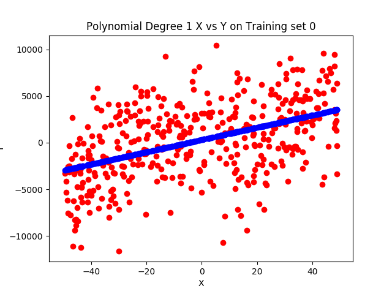
### y = ax<sup>2</sup> + bx + c
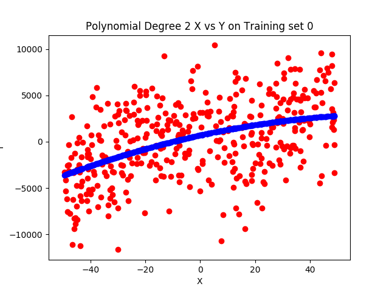

### y = ax<sup>3</sup>  + bx<sup>2</sup> + cx + d
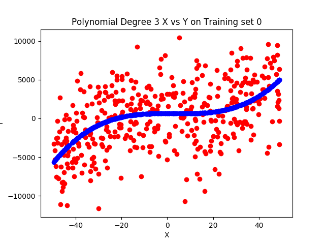

### y = ax<sup>4</sup>  + bx<sup>3</sup> + cx<sup>2</sup> + dx + e


### y = ax<sup>5</sup>  + bx<sup>4</sup> + cx<sup>3</sup> + dx<sup>2</sup> + ex + f


### y = ax<sup>6</sup>  + bx<sup>5</sup> + cx<sup>4</sup> + dx<sup>3</sup> + ex<sup>2</sup> + fx + g
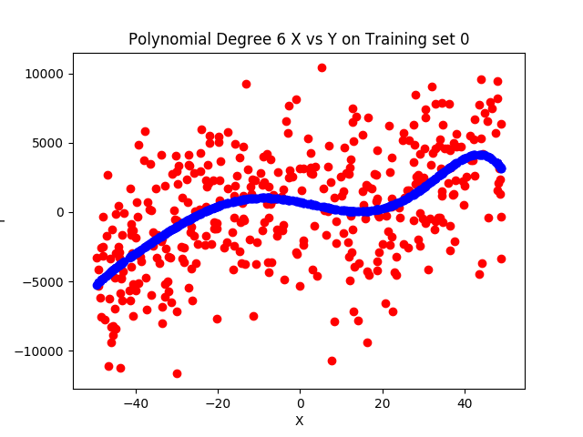

### y = ax<sup>7</sup>  + bx<sup>6</sup> + cx<sup>5</sup> + dx<sup>4</sup> + ex<sup>3</sup> + fx<sup>2</sup> + gx + h


### y = ax<sup>8</sup>  + bx<sup>7</sup> + cx<sup>6</sup> + dx<sup>5</sup> + ex<sup>4</sup> + fx<sup>3</sup> + gx<sup>2</sup> + hx + i
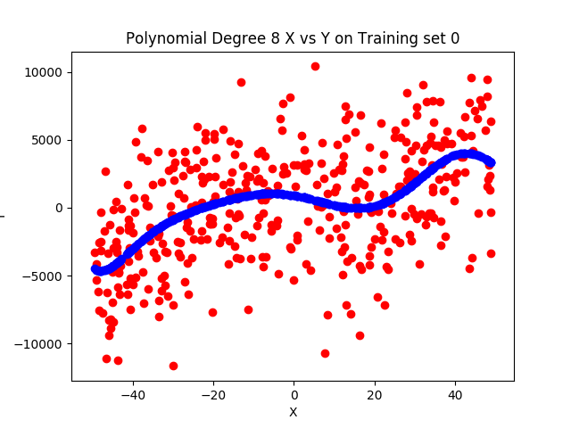

### y = ax<sup>9</sup>  + bx<sup>8</sup> + cx<sup>7</sup> + dx<sup>6</sup> + ex<sup>5</sup> + fx<sup>4</sup> + gx<sup>3</sup> + hx<sup>2</sup> + ix + j 
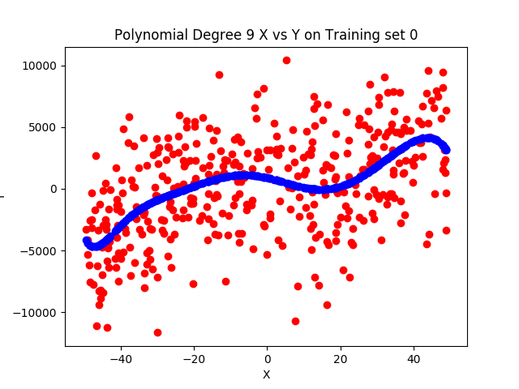


### Observervations

Here, it can be seen that the bias decreases as the complexity of the polynomial increases and the variance shows a slight increase as the degree of the polynomial increases.

This is in accordance with the Bias-Variance tradeoff where an optimum model is reached when total error is minimised.

When our polynomial is too simple and has very few parameters then a high
bias and low variance is observed. On the other hand, if our model has a large number of parameters then high variance and low bias is observed.

### Tabulated Values
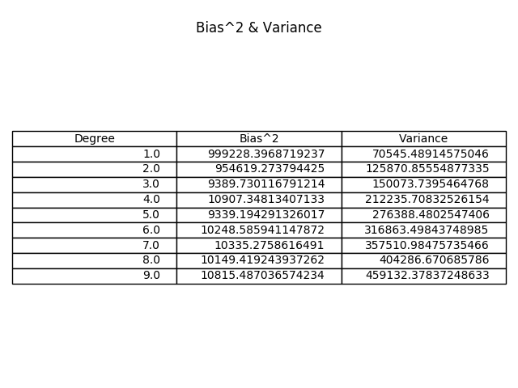
### Bias<sup>2</sup> Versus Variance Graph
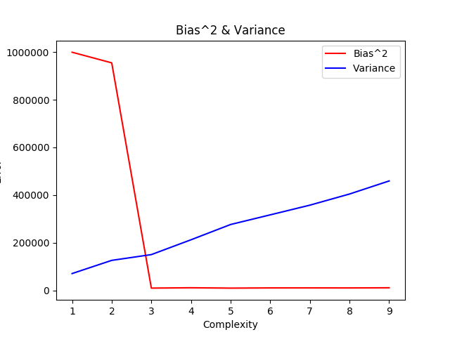