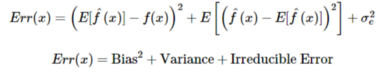
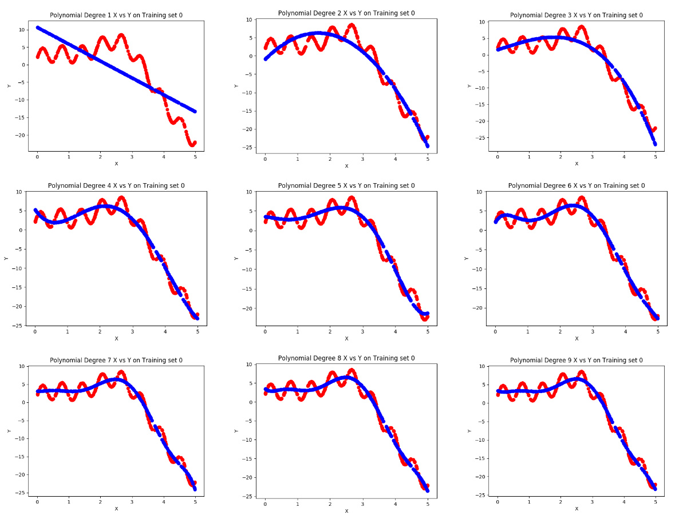
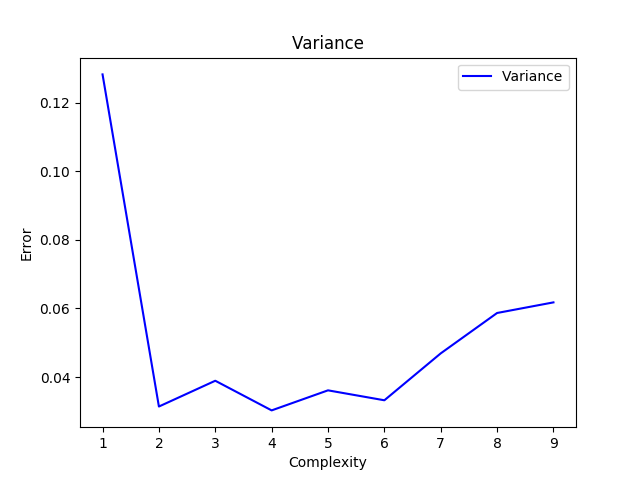
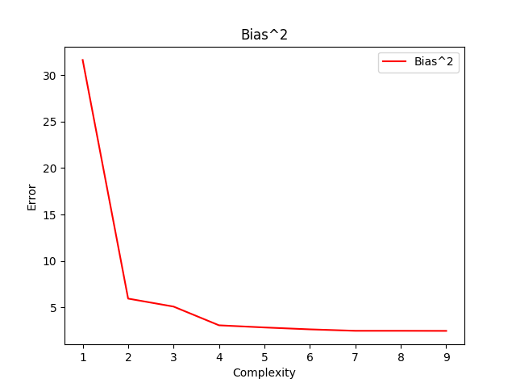
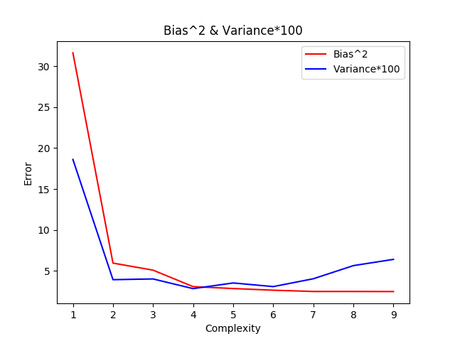
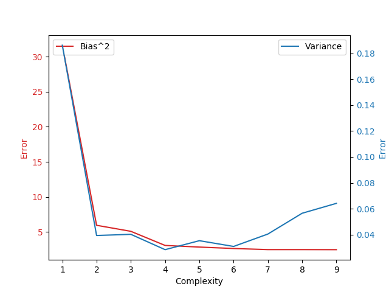
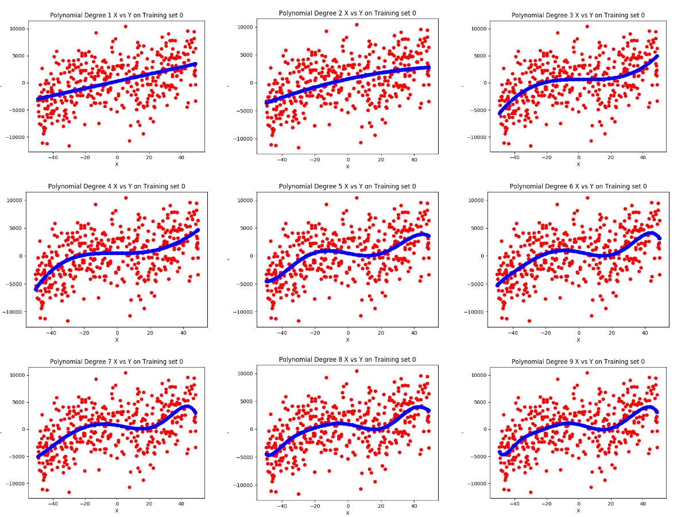
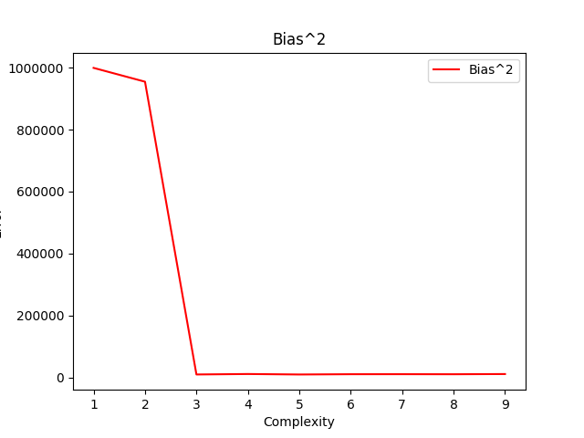

# Bias-Variance-Tradeoff

 Calculation of the bias and variance after training two models.

## Introduction

The **prediction error** for any machine learning algorithm can be broken down into three parts:

> ### Bias error
Bias is the difference between the average prediction of our model and the correct value which we are trying to predict.

<div style="text-align:center;"></div>

> ### Variance error
Variance is the variability of a model prediction for a given data point.
<div style="text-align:center;"></div>

> ### Irreducible error
Irreducible error cannot be reduced regardless of what algorithm is used. It arises due to the chosen framing of the problem and may be caused by factors like unknown variables that influence the mapping of the input variables to the output variables.

<div style="text-align:center;"></div>
<div style="text-align:center;"></div>

### Bias-Variance Trade-Off

Bias–variance problem is the conflict in trying to simultaneously minimize these two sources of error that prevent supervised learning algorithms from generalizing beyond their training set.

If the model is too simple and has very few parameters then it may have high bias and low variance. The model is unable to capture the underlying pattern of the data. This is known as ***underfitting***.

It may occur when we 
- Use less amount of data
- Try to build a linear model with a nonlinear data

On the other hand if the model has large number of parameters then it’s going to have high variance and low bias. The model captures the noise along with the underlying pattern in data. This is known as ***overfitting***. 

It may occur when we
- Use a small dataset and the model satisfies these datapoints exactly 
- Use an unnecessarily complex algorithm

<div style="text-align:center;"></div>

This tradeoff in complexity is why there is a tradeoff between bias and variance. An algorithm can’t be more complex and less complex at the same time.

> We need to find the right/good balance without overfitting and underfitting the data.

<div style="text-align:center"></div>

## Getting Started

 Unzip the folder, run the scripts and view the saved tables and graphs for question 1 and 2 in the current directory.
```bash
$ unzip 65_assgn1.zip
$ cd 65_assgn1
$ pip install -r requirements.txt
$ python3 q1.py  # Graph and table will be displayed and saved in current directory
$ eog graph1.png
$ eog table1.png
$ python3 q2.py  #Graph will be displayed and saved in the current directory
$ eog graph2.png
$ eog table2.png

```
Alternately, 
```bash
$ unzip 65_assgn1.zip
$ cd 65_assgn1
$ make all
$ make seeOne  # Data visualization for question 1
$ make seeTwo  # Data visualization for question 2
$ make clean
```
 
 ## Libraries Used
 ```python
# For data handling  
import pickle 
import numpy as np
import pandas as pd 
# To generate training and testing data splits
from sklearn.model_selection import train_test_split
# For data visualization            
import matplotlib.pyplot as plot
# To generate polynomial data and train the models 
from sklearn.linear_model import LinearRegression
from sklearn.preprocessing import PolynomialFeatures
 ```

## Question 1

### Data Resampling 

- 5000 entries of the form ( x<sub>i</sub> , y<sub>i</sub> ) are present are loaded using the `pickle` library, in numpy format.
  
```python
file = open('Assignment/Q1_data/data.pkl', 'rb')
data =  pickle.load(file)
file.close()
```
- 90:10 split of data as training set and testing set is done once using the `train_test_split` from `sklearn`.
```python
X_train, X_test, Y_train, Y_test = train_test_split(X, Y, test_size = 0.1)
```
- The training data is then reshuffled using the `np.random.shuffle` function.
```python
training_data = np.column_stack((X_train, Y_train))
np.random.shuffle(training_data)
X_train = training_data[:, 0]
X_train = X_train[:, np.newaxis]
Y_train = training_data[:, 1]
```

- The training data is then split into 10 subsets using the `np.array_split` funtion. This is done because inorder to calculate the variance we need multiple realisations of the model. An easy way to achieve this is to randomly divide the training set (if feasible) into multiple subsets (here, `10`), so that we have `10` different realisations of model.
  
```python
X_train_split = np.array_split(X_train, 10)
Y_train_split = np.array_split(Y_train, 10)
```

- `PolynomialFeatures(i)` is used to raise `x` data points to powers from 0 to `i` to generate data for polynomials of degree `i`.


### Bias - Variance Tradeoff

- We have repeated the entire model building process `10` times for each polynomial. 
- The outer loop chooses the polynomial and inner loop chooses 1 of the `10` training sets.

#### Calculating variance

- The variance is how much the predictions for a given point vary between different realizations of the model. 
This is calculated and averaged out for each polynomial as follows,

```python
    np.mean(np.var(poly_prediction, axis = 0))
```
- Here,  `poly_prediction` is a [10, 500] matrix containing the predicted outputs using the 10 models for each data point.

- `axis = 0` specificies that we traverse the matrix column-wise to obtain different model predictions for a single test data point.

#### Calculating bias

We subtract the Y_test values with the predicted values of X_test on each model.
We further average it out for each polynomial.

```python
    bias = abs(np.mean(poly_prediction, axis = 0) - Y_test) # 500 bias values - takes mean of all same polynomial models at a test point
```
- Here, `Y_test` represents the correct output value for the input data point.


### Listed are the plots for the models obtained using the `LinearRegression()` function using the first randomly generated test set for the respective polynomials.




<div style="text-align:left;"></div>
<br>
<div style="text-align:left;"></div>







### Observervations

The **bias decreases** and the **variance increases** as the *degree of the polynomial increases*.

That is, with increase in the number of features, or complexity (essentially increasing the degree of the model), the model becomes **more flexible**. It extracts more information from the training sets and fits the data well. The values it predicts are close to the actual values, giving lesser bias. 

However, as it extracts more information, it also starts **memorizing the noise**. It does not generalize well and gives a lot of variation on data sets that it has not seen before, ie variance increases.
Some (minor) bumps are observed in the variance graph but the overall trend is still increasing.

For lower degree polynomial models, we observe high bias and low variance. The model may not be able to perform well even on existing training data since the polynomial is so simple that it cannot capture the features of the training data. The variance is low since the model may not give accurate predictions but it does so consistently, generalizing well.

This is in accordance with the Bias-Variance tradeoff where an optimum model is reached when total error is minimised.

 ## Question 2

### Data Resampling 

- 20 subsets of 400 entries of X datapoints each are loaded as the training set and 1 set of 80 entries of X datapoints is loaded as the testing set using the `pickle` library, in numpy format. Corresponding Y sets are loaded as well.
```python
file = open('Assignment/Q2_data/X_train.pkl', 'rb')
X_train =  pickle.load(file)
file.close()
file = open('Assignment/Q2_data/Y_train.pkl', 'rb')
Y_train =  pickle.load(file)
file.close()
file = open('Assignment/Q2_data/X_test.pkl', 'rb')
X_test =  pickle.load(file)
file.close()
file = open('Assignment/Q2_data/Fx_test.pkl', 'rb')
Y_test =  pickle.load(file)
file.close()
```
- The training data has 20 subsets. This is now used to calculate the variance by generating multiple realisations of the model. 

- Now, the outer loop selects the degree of the polynomial and the inner loop chooses the training set and a model is generated for each traning set.

```python
for i in range(1, 10): # Choosing polynomial power 
    poly_prediction = []
    poly = PolynomialFeatures(i)
    X_test_poly = poly.fit_transform(X_test)

    for j in range(0, 20): # Choosing training set
        x_train = X_train[j]
        x_train = x_train[:,np.newaxis]

        X_poly = poly.fit_transform(x_train)
        linearRegressor.fit(X_poly, Y_train[j])  # Training model on subset

        X_test_poly = poly.fit_transform(X_test)            
        poly_prediction.append(linearRegressor.predict(X_test_poly)) # Predicting test set output on model
```
- The prediction of test set data on each model is appended to a list for that polynomial. This is used to calculate variance and bias further.

### Bias - Variance Tradeoff

- We have repeated the entire model building process `20` times for each polynomial. 

#### Calculating variance

The variance is how much the predictions for a given point vary between different realizations of the model.
This is calculated and averaged out for each polynomial as follows,

```python
    np.mean(np.var(poly_prediction, axis = 0))
```
- Here,  `poly_prediction` is a [20, 80] matrix containing the predicted outputs using the 20 models for each data point in the testing set of 80 points.

- `axis = 0` specificies that we traverse the matrix column-wise to obtain different model predictions for a single test data point.

#### Calculating bias

This is calculated and averaged out for each polynomial as follows,
```python
    (np.mean(poly_prediction, axis = 0) - Y_test)**2
```
- Here, `Y_test` represents the correct output value for the input data point.

### Listed are the plots for the models obtained using the `LinearRegression()` function using the first test set for the respective polynomials.




<div style="text-align:left;"></div>
<br>
<div style="text-align:left;"></div>


### Observervations

- The ***bias decreases*** and the ***variance increases*** steadily as the *degree of the polynomial increases*.

- That is, with increase in the number of features, or complexity (essentially increasing the degree of the model), the model becomes ***more flexible***. It extracts more information from the training sets and fits the data well. The values it predicts are close to the actual values, giving lesser bias. 

- However, as it extracts more information, it also starts ***memorizing the noise***. It does not generalize well and gives a lot of variation on data sets that it has not seen before, ie variance increases.

- For lower degree polynomial models, we observe high bias and low variance. The model may not be able to perform well even on existing training data since the polynomial is so simple that it cannot capture the features of the training data. The variance is low since the model may not give accurate predictions but it does so consistently, generalizing well.

- This is in accordance with the Bias-Variance tradeoff where an optimum model is reached when total error is minimised.
  
- Here it can be see from the graph that the optimum complexity is 3, tnat is, the polynomial of degree 3 is the best model in terms of having the best Bias-Variance Tradeoff.